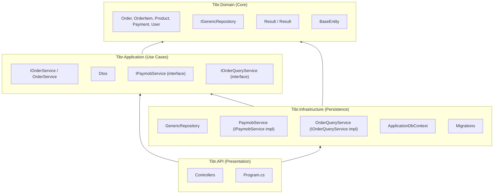

# Architecture Decisions

## Clean Architecture Layers



## Key Decisions

### 1. `IGenericRepository<TEntity, TId>` (Two Generic Parameters)

```csharp
public interface IGenericRepository<TEntity, TId>
    where TEntity : BaseEntity<TId>
{
    Task<TEntity?> GetByIdAsync(TId id);
    Task<TEntity?> GetById(TId id);
    // ...
}
```

**Why**: Different entities have different ID types:
- `Order`, `Product`, `User`, `Payment` → `long`
- Future entities might use `string` (e.g., external system IDs), `Guid`, or composite keys

**Trade-off**: Slightly more verbose at injection sites (`IGenericRepository<Order, long>` vs `IGenericRepository<Order>`), but avoids boxing/unboxing and supports non-numeric keys.

### 2. `GetByIdAsync` vs `GetById`

Both exist:
- `GetById(TId id)` — main's original design
- `GetByIdAsync(TId id)` — added during the Paymob merge for compatibility with existing service code

**When to use each**: Use `GetByIdAsync`. The non-`Async` variant exists only because it was already in main's interface. They behave identically.

### 3. Explicit `SaveChangesAsync`

```csharp
// WRONG — changes never persisted:
await _orderRepository.UpdateAsync(order);

// RIGHT:
await _orderRepository.UpdateAsync(order);
await _orderRepository.SaveChangesAsync();
```

**Why**: The repository does NOT auto-save. This is intentional — it allows multiple operations (add order + add items + update total) to be saved in a single transaction by calling `SaveChangesAsync` once at the end.

**Common mistake**: Forgetting `SaveChangesAsync`. This was a pre-existing bug in `OrderService` where `CreateAsync`, `UpdateAsync`, and `DeleteAsync` never called it. Changes appeared to work (EF change tracker returned in-memory state) but were never persisted to the database.

### 4. Query Services for Complex Queries

```csharp
// Generic repository — simple queries only:
var order = await _orderRepository.GetByIdAsync(id);

// Query service — complex queries with includes:
var order = await _orderQueryService.GetByIdWithDetailsAsync(id);
// → Includes: Order.User, Order.OrderItems, OrderItem.Product
```

**Why**: The generic repository uses `DbSet<T>.FindAsync()` which cannot do `Include`/`ThenInclude`. Instead of adding every possible query method to the generic repository, we created dedicated query services (`OrderQueryService`) that use `DbContext` directly for read operations.

**Rule**: The generic repository is for **write** operations. Query services are for **read** operations with joins.

### 5. `ActionResult<T>` on Controllers

```csharp
[HttpGet("{id:long}")]
public async Task<ActionResult<OrderDto>> GetById(long id)
```

**Why**: Produces clean OpenAPI/Swagger schemas. The response type in the OpenAPI spec shows `OrderDto` directly instead of wrapping it. Returning `NotFound()` or `BadRequest()` still works because `ActionResult<T>` is an implicit union of `T` and `ActionResult`.

### 6. Mapster Over AutoMapper

```csharp
var dto = entity.Adapt<OrderDto>();   // Mapster
// vs
var dto = _mapper.Map<OrderDto>(entity);  // AutoMapper
```

**Why**: Mapster is:
- Faster (compiled expressions vs reflection)
- Less ceremony (no profiles needed for simple mappings)
- Extension methods (no service injection required)

`IMapper` is still registered for cases where it's needed, but the `.Adapt<T>()` extension method is preferred.

### 7. In-Memory Paymob Order Map

```csharp
private static readonly ConcurrentDictionary<long, long> _paymobOrderMap = new();
```

**Limitation**: Lost on app restart. If the server goes down between intention creation and callback, the callback falls back to `special_reference` parsing.

**Alternative considered**: Persisting the mapping in the database. Rejected because it would require a new table and migration. The `special_reference` fallback is sufficient for now.

### 8. `DependencyInjection` Class Name Fix

The Infrastructure layer had a typo: `DependecyInjection`. This was fixed to `DependencyInjection` during the Paymob merge.

**Note**: The class is in `Tibr.Infrastructure` and registers infrastructure services. Application-layer DI is in `Tibr.Application.DependencyInjection`.

### 9. Result Pattern

```csharp
public class Result<T>
{
    public T? Data { get; }
    public string? ErrorMessage { get; }
    public bool IsFailure => ErrorMessage is not null;
    public bool IsSuccess => !IsFailure;
}
```

Used in service layer to avoid exceptions for expected failures (e.g., "order not found"). Controllers check `result.IsFailure` and return the appropriate HTTP status code.

**Note**: There is a naming conflict — `Result<T>.Failure(string)` hides `Result.Failure(string)`. The inherited member should use `new` or be renamed.
