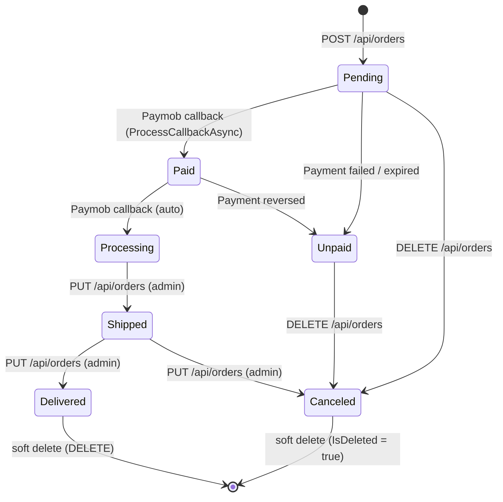
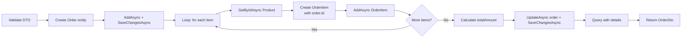

# Order Lifecycle



## Status Fields

Each order has two independent status fields:

| Field | Values | Set by |
|-------|--------|--------|
| `OrderStatus` | `Pending`, `Processing`, `Shipped`, `Delivered`, `Canceled` | `PUT /api/orders/{id}` (admin), Paymob callback |
| `PaymentStatus` | `Unpaid`, `Paid` | Paymob callback, `PUT /api/orders/{id}` |

They are independent — an order can be `Shipped` with `Unpaid` payment (bad practice, but possible via the API).

## Creating an Order (`CreateAsync`)



### Key Detail: Two-Phase Save

```csharp
// Phase 1: Save the order first to get its generated Id
await _orderRepository.AddAsync(order);
await _orderRepository.SaveChangesAsync(); // ← order.Id is now populated

// Phase 2: Create items referencing the generated order Id
foreach (var itemDto in createDto.Items)
{
    var product = await _productRepository.GetByIdAsync(itemDto.ProductId);
    var orderItem = new OrderItem { OrderId = order.Id, ... };
    await _orderItemRepository.AddAsync(orderItem);
}

// Phase 3: Update total and save
order.TotalAmount = totalAmount;
await _orderRepository.UpdateAsync(order);
await _orderRepository.SaveChangesAsync();
```

**Why two `SaveChangesAsync` calls**:
1. First save generates the `IDENTITY` value for `order.Id`
2. Second save persists the order items and total amount update

Without the first `SaveChangesAsync`, `order.Id` is `0` and all order items would get `OrderId = 0`.

## Payment Initiation

`POST /api/payment/initiate` does NOT change the order status. It only creates a Paymob intention. The order stays `PaymentStatus = "Unpaid"`.

The `orderId` is passed in `CreatePaymentRequest.OrderId` and stored as:
- `_paymobOrderMap[intention_order_id] = orderId` (primary resolution)
- `special_reference = "{orderId}-{guid}"` (fallback resolution)

## Payment Confirmation (Callback)

`ProcessCallbackAsync` transitions the order:

```csharp
order.PaymentStatus = "Paid";
order.OrderStatus = "Processing";
await _orderRepository.UpdateAsync(order);

var payment = new Payment
{
    OrderId = orderId,
    UserId = order.UserId,
    Amount = transaction.AmountCents / 100m,
    PaymentMethod = transaction.SourceData?.Type ?? "",
    Status = "Completed",
    PaidAt = DateTime.UtcNow,
};
await _paymentRepository.AddAsync(payment);

await _orderRepository.SaveChangesAsync();
```

**Important**: The `Payment` record and order status update happen in the same transaction (same DbContext).

## Soft Delete

```csharp
public async Task DeleteAsync(TEntity entity)
{
    entity.IsDeleted = true;  // ← sets the flag
    _dbSet.Update(entity);    // ← marks as modified
}
```

Not actually deleted from the database. All queries in `GenericRepository` and `OrderQueryService` filter with `!o.IsDeleted`.

## Query Services vs Generic Repository

| Concern | Used for |
|---------|----------|
| `IGenericRepository<Order, long>` | Create, Update, Delete, SaveChanges |
| `IOrderQueryService` | Read with Includes/ThenIncludes (complex queries) |

**Rule of thumb**: If you need `Include`, `ThenInclude`, or any join, use `IOrderQueryService`. If you need `AddAsync`, `UpdateAsync`, `DeleteAsync`, use the generic repository.

## Order DTOs

```csharp
// Request
CreateOrderDto  → { UserId, Items: [{ ProductId, Quantity }] }
UpdateOrderDto  → { PaymentStatus?, OrderStatus? }

// Response
OrderDto → { Id, UserId, OrderNumber, TotalAmount,
              PaymentStatus, OrderStatus, Items: [OrderItemDto] }
```

The `OrderDto` is returned from all endpoints. `OrderItemDto` contains `ProductId`, `Quantity`, `Price`.
