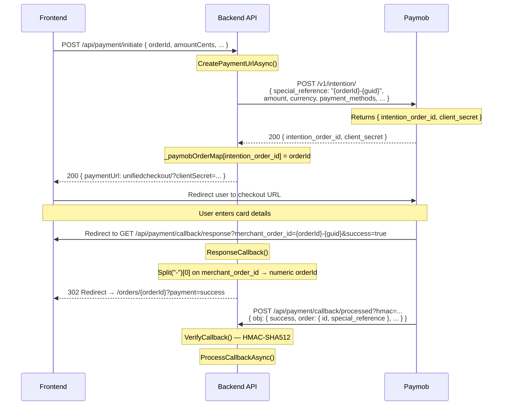

# Paymob Payment Flow



## Key Mechanisms (Easy to Forget)

### 1. Order ID Mapping (`_paymobOrderMap`)

```csharp
// thread-safe in-memory mapping
private static readonly ConcurrentDictionary<long, long> _paymobOrderMap = new();
// Key: Paymob's intention_order_id (from intention response)
// Value: Our OrderId
```

**Why**: Paymob's callback webhook sends `order.id` (Paymob's own order ID), not our OrderId. We save the mapping at intention creation time to resolve it later.

**Flow**:
1. `POST /v1/intention/` → response contains `intention_order_id` (e.g., 12345)
2. Store: `_paymobOrderMap[12345] = ourOrderId` (e.g., 15)
3. Callback arrives with `obj.order.id = 12345`
4. Lookup: `_paymobOrderMap.TryGetValue(12345, out ourOrderId)` → `15`

**Limitation**: In-memory only — lost on app restart. If the server restarts between intention creation and callback, the callback cannot resolve the order via the map.

### 2. Fallback: `special_reference` Parsing

When the map lookup fails (e.g., after restart), we fall back to `special_reference`:

```csharp
var orderIdString = transaction.Order?.SpecialReference;
if (!long.TryParse(orderIdString, out orderId)) { /* warn and return */ }
```

**Format**: `special_reference = "{orderId}-{guid}"`, e.g., `"15-a1b2c3d4e5f6..."`

We send the compound format to ensure **uniqueness** — Paymob rejects duplicate `special_reference` values. The `{guid}` suffix guarantees each call is unique.

### 3. Redirect: `merchant_order_id` → Numeric ID

Paymob mirrors `special_reference` back as the `merchant_order_id` query parameter in the redirect URL.

```csharp
// Paymob sends: /callback/response?merchant_order_id=15-a1b2c3d4...&success=true
var rawOrderId = Request.Query["merchant_order_id"].FirstOrDefault();
var numericId = rawOrderId?.Split('-')[0];
// redirectUrl = "http://localhost:4200/orders/15?payment=success"
```

**Frontend receives a clean numeric ID** — no changes needed on the frontend.

### 4. HMAC Verification

```csharp
// Fields concatenated in this exact order (from Paymob docs):
var data = string.Concat(
    t.AmountCents, t.CreatedAt, t.Currency,
    t.ErrorOccured, t.HasParentTransaction, t.Id,
    t.IntegrationId, t.Is3dSecure, t.IsAuth, t.IsCapture,
    t.IsRefunded, t.IsStandalonePayment, t.IsVoided,
    t.Order?.Id, t.Owner, t.Pending,
    t.SourceData?.Pan, t.SourceData?.SubType, t.SourceData?.Type,
    t.Success
);

using var hmac = new HMACSHA512(Encoding.UTF8.GetBytes(hmacSecret));
var computed = Convert.ToHexString(hmac.ComputeHash(Encoding.UTF8.GetBytes(data))).ToLower();
return computed == receivedHmac.ToLower();
```

**`t.Order?.Id`** uses Paymob's order ID (not ours). This is important — the HMAC is computed against Paymob's IDs, not ours.

### 5. Callback Always Returns 200

```csharp
// Paymob expects a 200 OK — always return 200 even on failure
return Ok();
```

Even if HMAC verification fails or processing fails, return 200. Paymob retries webhooks on non-200 responses, which could cause duplicate processing.

### 6. `SaveChangesAsync` Must Be Called Explicitly

The `GenericRepository` does NOT auto-save. Every method that modifies the database must call `SaveChangesAsync`:

```csharp
// In ProcessCallbackAsync:
order.PaymentStatus = "Paid";
await _orderRepository.UpdateAsync(order);

await _paymentRepository.AddAsync(payment);

await _orderRepository.SaveChangesAsync(); // ← required!
```

Both repositories share the same scoped `DbContext`, so calling `SaveChangesAsync` on either one persists all tracked changes.
