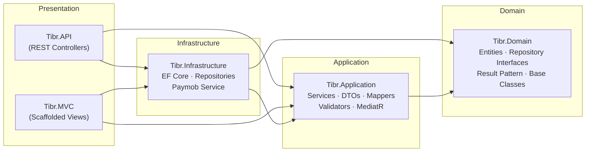
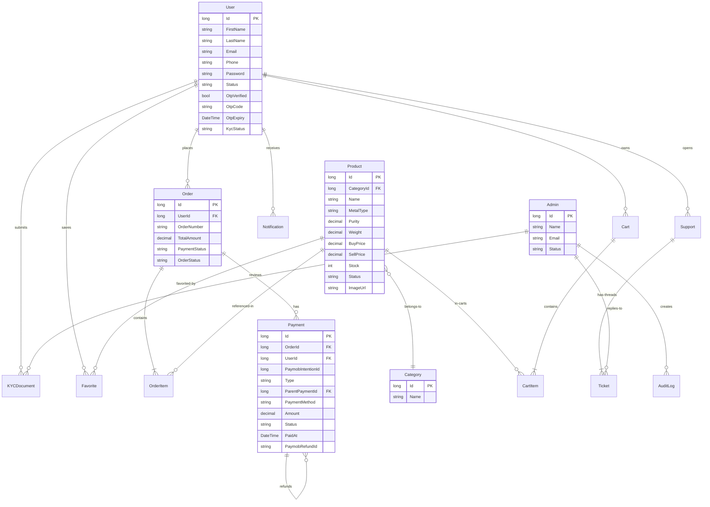
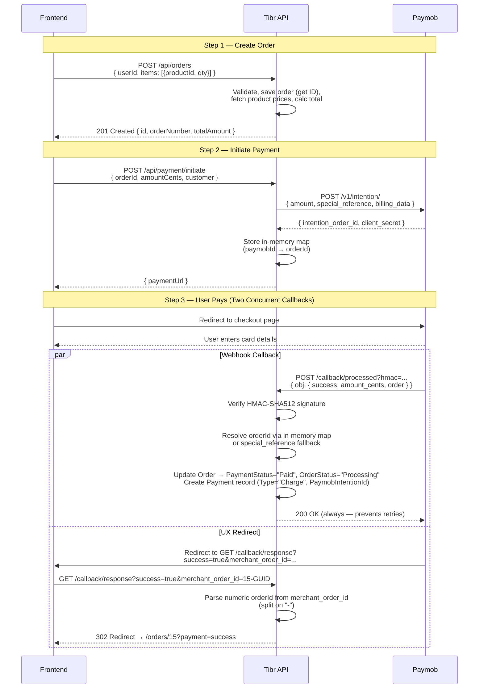
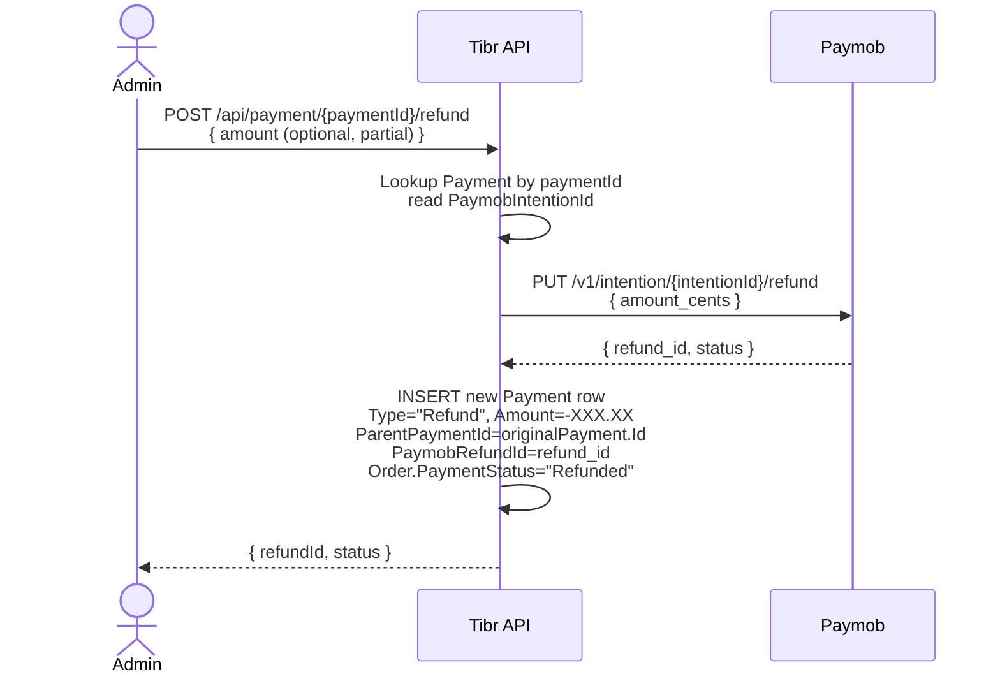
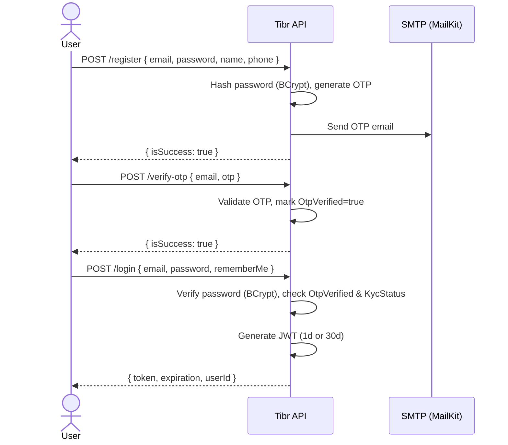

# Tibr — Project Overview

## 1. Domain & Purpose

**Tibr** (Arabic: تبر, *raw gold*) is a backend platform for an online **gold and precious metals trading marketplace**. It enables consumers to browse gold products by metal type, purity, and weight; manage a shopping cart; place orders; and pay via **Paymob**, an Egyptian payment gateway. Administrators manage products, categories, KYC document verification, support tickets, and order fulfillment.

The platform serves two user roles:

| Role | Responsibilities |
|------|-----------------|
| **Consumer** | Browse products, manage cart/favorites, place orders, make payments, track order status, submit support tickets |
| **Admin** | Manage products & categories, verify KYC documents, respond to support tickets, audit order lifecycle |

---

## 2. System Architecture

The solution follows **Clean Architecture** with four layers and strict inward-only dependencies.

| Layer | Responsibilities | Depends On |
|-------|-----------------|------------|
| **Domain** | Core entities, repository interfaces, enums, base classes with soft-delete and audit timestamps | — |
| **Application** | Use-case orchestration, DTOs, Mapster mapping profiles, FluentValidation rules, MediatR commands/handlers, service interfaces + implementations | Domain |
| **Infrastructure** | EF Core DbContext + migrations, generic + specific repository implementations, Paymob HTTP integration, query services for complex reads | Application, Domain |
| **Presentation (API)** | REST controllers, middleware (auth, CORS, OpenAPI), startup wiring, configuration binding | Application, Infrastructure |

### Technology Stack

| Component | Technology |
|-----------|-----------|
| Runtime | .NET 10 |
| Database | SQL Server (EF Core 10) |
| Validation | FluentValidation with auto-pipeline |
| Mapping | Mapster (`IRegister` profiles, `.Adapt<T>()`) |
| Auth | JWT Bearer tokens, BCrypt password hashing, MailKit SMTP for OTP |
| CQRS | MediatR (auth commands) |
| Payments | Paymob Intention API |
| API Docs | OpenAPI / Swagger |
| Testing | xUnit, WebApplicationFactory |

---

## 3. Domain Model

Fifteen entities organized across six aggregates, all inheriting from `BaseEntity<long>` which provides `Id`, `CreatedAt`, `UpdatedAt`, and `IsDeleted` (soft-delete).

### Key Entity Details

| Entity | Key Properties | Precision |
|--------|---------------|-----------|
| `Product` | MetalType (`Gold`/`Silver`), Purity (e.g. 21.0), Weight (grams), BuyPrice, SellPrice, Stock | `decimal(18,2)` for prices, `decimal(18,3)` for weight, `decimal(10,4)` for purity |
| `Order` | OrderNumber (`ORD-{Guid}`), TotalAmount, PaymentStatus, OrderStatus | `decimal(18,2)` |
| `Payment` | Type (`Charge`/`Refund`), Amount, PaymentMethod, Status (`Pending`/`Completed`/`Failed`/`Refunded`), PaidAt, PaymobIntentionId, ParentPaymentId (self-FK for refunds), PaymobRefundId | `decimal(18,2)` |
| `KYCDocument` | DocumentType, DocumentNumber, front/back/selfie image paths, Status |
| `Support` / `Ticket` | Subject, threaded messages with admin replies |

---

## 4. API Surface

### 4.1 Authentication — `/api/auth`

| Method | Route | Description | Auth |
|--------|-------|-------------|------|
| POST | `/api/auth/register` | Register with name, email, phone, password; sends OTP email | Anonymous |
| POST | `/api/auth/verify-otp` | Verify email with OTP code | Anonymous |
| POST | `/api/auth/login` | Authenticate, returns JWT (1d or 30d with RememberMe) | Anonymous |
| POST | `/api/auth/forgot-password` | Send OTP to email for password reset | Anonymous |
| POST | `/api/auth/reset-password` | Reset password with OTP | Anonymous |
| POST | `/api/auth/submit-kyc` | Upload KYC documents (front, back, selfie) | Anonymous |

JWT payload includes `NameIdentifier`, `Email`, and `Name` claims. The standard `[Authorize]` attribute works out of the box with this setup — it checks that `HttpContext.User.Identity.IsAuthenticated` is true via the validated JWT.

**Role-based access is not yet enforced.** The JWT does not carry a `ClaimTypes.Role` claim. Once added (in `LoginCommand`):
- `[Authorize]` restricts to any authenticated user
- `[Authorize(Roles = "Admin")]` restricts to admins

Currently `[Authorize]` attributes on endpoints are commented out. Auth responses are bilingual (AR/EN).

### 4.2 Products — `/api/product`

| Method | Route | Description | Auth |
|--------|-------|-------------|------|
| GET | `/api/product` | Browse products with filtering, sorting, pagination | Public |
| GET | `/api/product/{id}` | Get product details | Public |
| GET | `/api/product/{id}/stock` | Check stock level | Public |
| GET | `/api/product/admin` | List all products (including inactive) | Admin |
| POST | `/api/product` | Create product | Admin |
| PUT | `/api/product/{id}` | Update product | Admin |
| PATCH | `/api/product/{id}/stock` | Update stock only | Admin |
| DELETE | `/api/product/{id}` | Soft-delete product | Admin |

**Filtering parameters:** `SearchKeyword`, `CategoryId`, `CategoryName`, `MetalType`, `MinWeight`/`MaxWeight`, `MinPurity`/`MaxPurity`, `MinPrice`/`MaxPrice`, `IncludeOutOfStock`

**Sorting options:** `price_asc`, `price_desc`, `weight_asc`, `weight_desc`, `purity_asc`, `purity_desc`, `popularity` (favorites + order items), `newest` (default)

### 4.3 Categories — `/api/category`

| Method | Route | Description | Auth |
|--------|-------|-------------|------|
| GET | `/api/category` | List all categories (with product count) | Public |
| GET | `/api/category/{id}` | Get category by ID | Public |
| POST | `/api/category` | Create category (duplicate-name check) | Admin |
| PUT | `/api/category/{id}` | Update category | Admin |
| DELETE | `/api/category/{id}` | Soft-delete category | Admin |

### 4.4 Orders — `/api/orders`

| Method | Route | Description |
|--------|-------|-------------|
| GET | `/api/orders` | List all orders |
| GET | `/api/orders/{id}` | Get order by ID (with items and user) |
| GET | `/api/orders/user/{userId}` | Get orders for a specific user |
| POST | `/api/orders` | Create order with items (server-calculated total) |
| PUT | `/api/orders/{id}` | Update order status |
| DELETE | `/api/orders/{id}` | Soft-delete order |

Order creation flow: validates DTO → saves order to get identity ID → for each item, fetches product sell price → creates order item with `Price = Product.SellPrice` → calculates total → saves atomically.

### 4.5 Payment — `/api/payment`

| Method | Route | Description |
|--------|-------|-------------|
| POST | `/api/payment/initiate` | Create Paymob payment intention, return checkout URL |
| POST | `/api/payment/callback/processed` | Paymob webhook — HMAC-verified callback, updates order and creates payment record |
| GET | `/api/payment/callback/response` | Browser redirect after payment UX → 302 to frontend |

The payment flow is detailed in Section 5.

### 4.6 Support — `/api/support`

| Method | Route | Description |
|--------|-------|-------------|
| GET | `/api/support` | List all support tickets |
| GET | `/api/support/{id}` | Get ticket with replies |
| POST | `/api/support` | Create support request |
| PUT | `/api/support/{id}` | Update ticket |
| DELETE | `/api/support/{id}` | Delete ticket |

---

## 5. Payment Flow (Paymob Integration)

The payment flow connects the frontend (Angular, `localhost:4200`), the Tibr API, and Paymob in three steps:

### Key Design Decisions

| Decision | Rationale |
|----------|-----------|
| **Two callbacks** | Webhook is system-of-truth (state change); browser redirect is UX-only (302 to frontend) |
| **`special_reference = "{OrderId}-{Guid:N}"`** | Ensures each intention call is unique (Paymob rejects duplicates); order ID extracted via `Split('-')[0]` |
| **HMAC-SHA512** | 20 transaction fields concatenated in Paymob-specified order, verified before any state mutation |
| **Always return 200 on webhook** | Prevents Paymob from retrying the callback |
| **In-memory `ConcurrentDictionary`** | Fast primary lookup for Paymob order ID → internal order ID; `special_reference` parse is fallback |
| **Single `SaveChangesAsync`** | Order update and Payment creation in same transaction, atomic persistence |
| **Ledger-based Payment table** | One `Payment` table with `Type` (`Charge`/`Refund`), `ParentPaymentId` self-FK, and `PaymobIntentionId`/`PaymobRefundId`. Every charge and refund is an immutable row — no mutation, full audit trail. |

### Planned — Refund Flow

---

## 6. Auth Flow

---

## 7. Cross-Cutting Patterns

| Pattern | Implementation |
|---------|---------------|
| **Soft Delete** | `BaseEntity.IsDeleted` — all queries filter `IsDeleted = false`, `DeleteAsync` sets flag instead of removing rows |
| **Result Pattern** | `Result` / `Result<T>` in Domain — services return `Result<T>` with `IsSuccess`/`IsFailure`/`ErrorMessage`; avoids exceptions for expected failures |
| **Generic Repository** | `IGenericRepository<TEntity, TId>` with soft-delete, `AsNoTracking`, predicate-based filtering; concrete types (`CategoryRepository`, `ProductRepository`) add entity-specific queries |
| **Query Service** | `IOrderQueryService` / `OrderQueryService` — separates complex `Include`/`ThenInclude` reads from the write-oriented generic repository |
| **CQRS-light** | MediatR for auth commands (Register, Login, VerifyOtp, etc.); direct service classes for domain operations (Order, Product, Category) |
| **Validation Pipeline** | FluentValidation validators automatically invoked before controller action execution via `AddFluentValidationAutoValidation()` |
| **Options Pattern** | Strongly-typed configuration via `IOptions<T>` for `PaymobSettings`, `JWT`, `EmailSettings` |

---

## 8. Current Status & What's Next

### Implemented

- [x] JWT authentication with register, login, OTP verification, password reset
- [x] Product CRUD with advanced filtering, sorting, pagination
- [x] Category CRUD with duplicate-name prevention
- [x] Order CRUD with auto-calculated totals
- [x] Paymob payment integration (Intention API, HMAC callbacks, redirect)
- [x] Support ticket system
- [x] KYC document upload
- [x] Soft-delete on all entities
- [x] FluentValidation, Mapster, OpenAPI configuration
- [x] SQL Server database with seed data

### Not Yet Implemented

- [ ] **Role claim on JWT** — add `ClaimTypes.Role` in `LoginCommand`, uncomment `[Authorize]` on endpoints
- [ ] Cart & Favorites API endpoints (entity + DB exist)
- [ ] Notification API (entity + DB exist)
- [ ] Audit log API (entity + DB exist)
- [ ] Admin dashboard/panel (entity exists, no controller/service)
- [ ] Payment refund — new `POST /api/payment/{id}/refund` endpoint, `PaymobIntentionId` + `PaymobRefundId` on Payment, ledged via `Type="Refund"` / `ParentPaymentId` self-FK
- [ ] Frontend integration (Angular app exists at `localhost:4200` but is separately developed)
- [ ] Email templates (currently inline HTML in `RegisterCommand`; extract to proper template files)
- [ ] Health checks, structured logging, rate limiting

### Recommended Roadmap

1. **Enforce auth** — Add role claim to JWT, uncomment `[Authorize]` on endpoints, define Consumer vs Admin roles
2. **Cart & Favorites** — API endpoints for add/remove/checkout transformation (PR in progress)
3. **Payment refund** — Add `PaymobIntentionId` to Payment, implement `POST /api/payment/{id}/refund` with ledger-based refund records
4. **Frontend** — Wire the Angular app to the API
5. **KYC & Admin** — Review workflow, notification system, audit log
6. **Production hardening** — Rate limiting, HTTPS enforcement, structured logging, health checks
